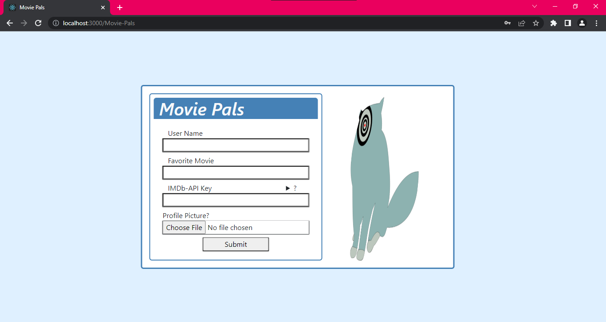
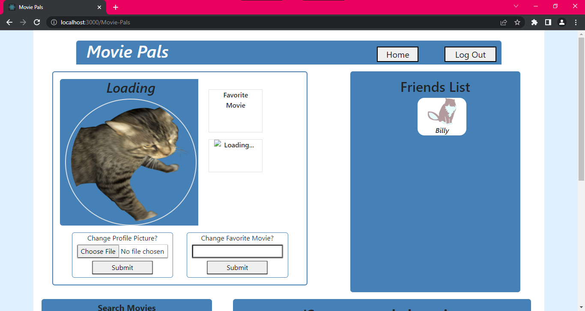
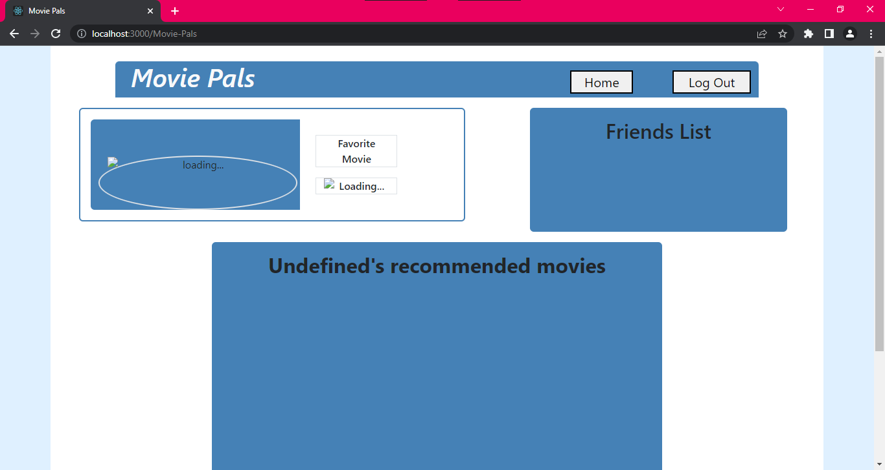

# Movie-Pals

## Sources
This project is dependent on fetching data from IMDb's API (https://imdb-api.com/). All movie related content that is displayed (movie posters, movie titles, and movie year dates) is provided by IMDb's API. 

## Site
https://marcelino-g.github.io/Movie-Pals/

## What
Movie Pals is an idea for a social media platform that revolves around movies. With Movie Pals, you are able to create an account that will allow you to share the movies you love with friends by displaying your own customized movie list on your profile. You are also able to view your friends favorite movies by exploring their profile.

## Page Description
- Desktop View

  When first visiting the page, you are greeted with a "form" that is displayed at the center of the page. Next to the form is the logo that represents Movie Pals, a cat with a video camera lens as an eye that also appears with the "loading" page. A loading page will appear whenever you call new/refresh data. After filling out criteria, the next page displays your "user profile". At the top of it is your navigation bar where you are able to go "home" to your profile or "log out" back to the form page. Underneath the nav bar, to the left, is the "users information" section that is dependent on the inputs of the form which displays the users name, favorite movie, and profile picture. Your "favorite movie" is displayed as the movie poster, movie name, and movie year which is the format for displaying movies throughout this project. Below this information you are able to modify some user details. To the right of the users information is the users "friends list" section which displays clickable users that direct you to their page. Below the user information and friends list sections is the "search movies" section and "recommended movies" section. In the "search movies" section you are able to type into the input field a movie of your choice. After searching, you are then able to add the movie to your "recommended movies" section which displays your own list of movies as you add on. When you browse over one of your recommended movies, you are able to remove it for further customization of your profile. When clicking on a friend to view their profile, the sections that are removed are the areas that allow for profile customization like being able to change your profile picture and favorite movie, search for movies to add to your "recommended movie" section, and the ability to remove a movie. 
  
## Completed Pictures
#### form page

#### user page

#### friends page

